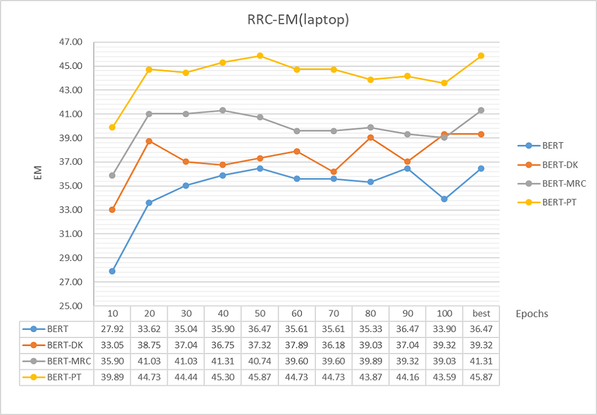

<div align=center>
    <div style="font-size:24px">
        <b>BERT Post-Training for Review Reading Comprehension and Aspect-based Sentiment Analysis</b>
    </div>
</div>

This is the reproduce for the papaer [BERT Post-Training for Review Reading Comprehension and Aspect-based Sentiment Analysis](https://www.aclweb.org/anthology/N19-1242.pdf)

## Problem to solve
* **RRC**: Given a question `q = (q_1, ..., q_m)` from a customer (or user) about a product and a review `d = (d_1, ..., d_n)` for that product containing the information to answer `q`, find a sequence of tokens (a text span) `a = (d_s, ..., d_e)` in `d` that answer `q` correctly, where `1 <= s <= n`, `1 <= e <= n`, and `s <= e`.


## Environment
    * apex
    * python 3.7.4
    * pytorch 1.2.0
    * transformers
    * 运行环境：GPU:TITAN RTX  CUDA 10.0


## Prepare

1.  配置好相应的实验环境.

2.  下载实验数据：
    * [rrc dataset](https://drive.google.com/open?id=1NJv4NaPTgFNB5Q8fXPQkxLLXn5a0ASWe)
    * [dormain knowledge dataset](https://drive.google.com/open?id=1z4UhQRlh-IbKjQy7yTDnv9ZXt8tJD9N2)
    * [machine reading comprehension dataset](https://drive.google.com/open?id=1HaB--VS8XiwU7MPYEDlOSw4SJByvxE2K)   
    其中 RRC 为原始数据， DK 和 MRC 为预处理后的数据.

3.  RRC 项目目录结构如下：

```python
└── RRC                                 # RRC 项目目录
    ├── data                            # 实验数据
    │   ├── rrc                         # rrc 数据
    │   │
    │   ├── domain_corpus               # dk 数据
    │   │
    │   └── squad                       # mrc 数据
    │
    ├── bert-pretrained-model           # 预训练的 BERT 模型权重
    │   ├── bert-base-uncased           # bert-base 权重
    │   │
    │   ├── DK                          # 仅使用 DK 数据训练的 BERT 权重
    │   │
    │   ├── MRC                         # 仅使用 MRC 数据训练的 BERT 权重
    │   │
    │   └── PT                          # 使用 DK 和 MRC 数据训练的 BERT 权重
    │
    ├── results                         # 实验运行结果
    │
    ├── data_preprocessing.py           # 数据预处理
    ├── run_pt.py                       # Post-Training 训练权重
    └── run_rrc.py                      # 运行 RRC
```


## Post-Training
训练权重

1. **DK** 
    ```bash
    python run_pt.py --review_data laptop --mode DK
    python run_pt.py --review_data rest --mode DK
    ```

2. **MRC**
    ```bash
    python run_pt.py --mode MRC
    ```

3. **PT**
    ```bash
    python run_pt.py --review_data laptop --mode PT
    python run_pt.py --review_data rest --mode PT
    ```


## Experiments on RRC

* 使用预训练的权重在 RRC 数据集上进行训练及测试：

1. **BERT** 
    ```bash
    python run_rrc.py --data_file laptop
    python run_rrc.py --data_file rest
    ```

2. **BERT-DK** 
    ```bash
    python run_rrc.py --data_file laptop --bert_model DK/laptop
    python run_rrc.py --data_file rest --bert_model DK/rest
    ```

3. **BERT-MRC**
    ```bash
    python run_rrc.py --data_file laptop --bert_model MRC
    python run_rrc.py --data_file rest --bert_model MRC
    ```

4. **BERT-PT**
    ```bash
    python run_rrc.py --data_file laptop --bert_model PT/laptop
    python run_rrc.py --data_file rest --bert_model PT/rest
    ```

## Results

1. For laptop:

    <div align=center>
        
        
    </div>

2. For rest:

    <div align=center>
        
        
    </div>

